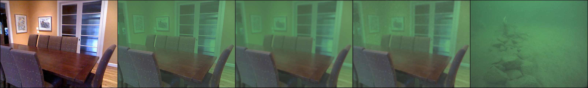

# UFEN-GAN

Code and models for **"Knowledge Distillation for Underwater Feature Extraction and Matching via GAN-synthesized Images"**.

This project introduces an **adaptive GAN-based image synthesis** method that estimates environment-specific underwater conditions, considering both noise distribution and forward scattering.

## 📷 Visual Example

<p align="center">
  
</p>

<p align="center">
  <strong>Figure:</strong> Example of synthetic images showing: (1) in-air image, (2) simplified model output, (3) with forward scattering, (4) with generated noise, and (5) target environment.
</p>


---

## 🔧 Inference Demo

A fast implementation for synthetic image generation is available in the `inference/` folder.

To run the demo:

```bash
cd inference
python synthetic_demo.py
```

Pretrained weights can be downloaded from [Google Drive](https://drive.google.com/drive/folders/1PBefKnEHxgE8K_xqZ6prpdIxbJKfbE47?usp=drive_link)

Please place the weights into the `inference/weights/` folder.

---

## ✅ To-Do

- [ ] Release GAN training code

---

## 📌 Reference

Our method builds on parts of:  
https://github.com/astra-vision/GuidedDisent  
https://github.com/NVlabs/MUNIT